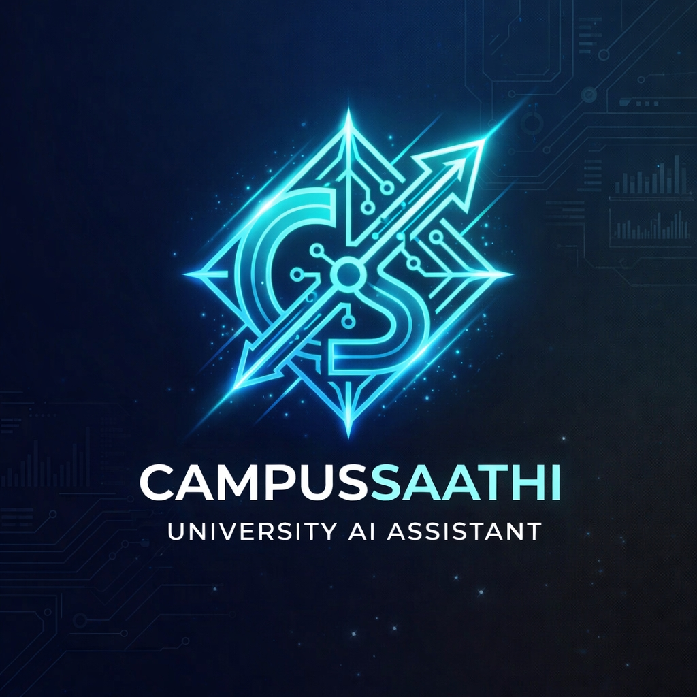

# 🎓 CampusSaathi AI
### Multilingual Intelligent Campus Assistant

<p align="center">
  
</p>

<p align="center">
  AI-Powered • Multilingual • Voice Enabled • RAG-Based Campus Assistant
</p>

---

## 🚀 Overview

CampusSaathi AI is a multilingual AI-powered campus assistance platform designed to simplify academic and administrative workflows inside educational institutions.

Built using **Python**, **Streamlit**, **Google Gemini AI**, and **Faster-Whisper**, the platform provides intelligent assistance for:

- 👨‍🎓 Students
- 👨‍🏫 Teachers / Staff
- 👨‍👩‍👧 Parents

The system combines:

- 🧠 Retrieval-Augmented Generation (RAG)
- 🌐 Multilingual NLP
- 🎙️ Speech Recognition
- 🤖 Generative AI

to deliver structured, real-time campus guidance.

---

# ✨ Features

## 🧠 AI-Powered Campus Assistance

- Context-aware conversational AI
- Google Gemini integration
- Intelligent procedural guidance
- Structured response generation
- Dynamic query handling

---

## 🌐 Multilingual Support

Supports:

- English
- Hindi (हिन्दी)
- Gujarati (ગુજરાતી)
- Tamil (தமிழ்)
- Telugu (తెలుగు)
- Marathi (मराठी)

### ✅ Automatic Language Detection

> Input Language = Output Language

---

## 🎙️ Voice-to-Text Queries

Powered by **Faster-Whisper**

Features:
- Real-time voice input
- Multilingual speech recognition
- Hands-free interaction
- Fast CPU inference

---

## 👥 Role-Based Workflows

Dedicated dashboards for:

### 👨‍🎓 Students
- Scholarships
- Hostel services
- Certificates
- Fee queries
- Academic procedures
- Abroad studies

### 👨‍🏫 Teachers / Staff
- Office navigation
- Leave procedures
- Department assistance

### 👨‍👩‍👧 Parents
- Guest room support
- Student academic assistance
- Admission guidance

---

## 📚 Institutional Knowledge Base

The platform uses a structured JSON knowledge base storing:

- Admission procedures
- Scholarship workflows
- Hostel rules
- Academic regulations
- Required documents
- Office timings
- Certificate procedures
- Campus navigation

---

# 🏗️ System Architecture

```text
User Query / Voice Input
        ↓
Language Detection
        ↓
Speech-to-Text (Faster-Whisper)
        ↓
RAG Knowledge Retrieval
        ↓
Google Gemini AI Processing
        ↓
Structured Multilingual Response
```

---

# 📂 Project Structure

```text
CampusSaathiAI/
│
├── app.py
├── chatbot.py
├── speech_to_text.py
├── language_detector.py
├── ui_components.py
├── knowledge_base.json
├── requirements.txt
├── README.md
├── .env.example
│
└── assets/
    ├── styles.css
    ├── logo.png
    └── avatar.png
```

---

# 🛠️ Tech Stack

| Category | Technologies |
|----------|--------------|
| Frontend | Streamlit, HTML5, CSS3 |
| Backend | Python |
| AI/ML | Google Gemini AI, Faster-Whisper |
| NLP | LangDetect |
| Database | JSON Knowledge Base |
| Architecture | RAG (Retrieval-Augmented Generation) |

---

# ⚙️ Installation

## 1️⃣ Clone Repository

```bash
git clone https://github.com/YOUR_USERNAME/CampusSaathi-AI.git
cd CampusSaathi-AI
```

---

## 2️⃣ Create Virtual Environment

### Windows

```bash
python -m venv venv
venv\Scripts\activate
```

### Linux / Mac

```bash
python3 -m venv venv
source venv/bin/activate
```

---

## 3️⃣ Install Dependencies

```bash
pip install -r requirements.txt
```

---

## 4️⃣ Configure Environment Variables

Create a `.env` file:

```env
GEMINI_API_KEY=your_google_gemini_api_key
```

Get your API key from:

https://aistudio.google.dev

---

# ▶️ Run the Application

```bash
streamlit run app.py
```

Application runs at:

```text
http://localhost:8501
```

---

# 🎯 Usage Flow

1. Select your role
2. Choose preferred language
3. Explore FAQs
4. Ask questions via:
   - Text Input
   - Voice Input
5. Receive:
   - Required documents
   - Office details
   - Timings
   - Procedures
   - Approvals
   - Processing duration

---

# 🌍 Deployment

## Streamlit Community Cloud

1. Push repository to GitHub
2. Open Streamlit Cloud
3. Create New App
4. Select repository
5. Add Secrets:

```toml
GEMINI_API_KEY="your_api_key"
```

6. Deploy 🚀

---

# 🔒 Security

- Environment variables secured using `.env`
- API keys ignored via `.gitignore`
- Modular scalable architecture

---

# 🔮 Future Enhancements

- Vector databases (FAISS / ChromaDB)
- LMS API integration
- OCR document verification
- Mobile application
- Real-time hostel room availability
- Voice response generation

---

# 📸 Screenshots


---

# ⭐ If you like this project

Give it a star on GitHub ⭐
